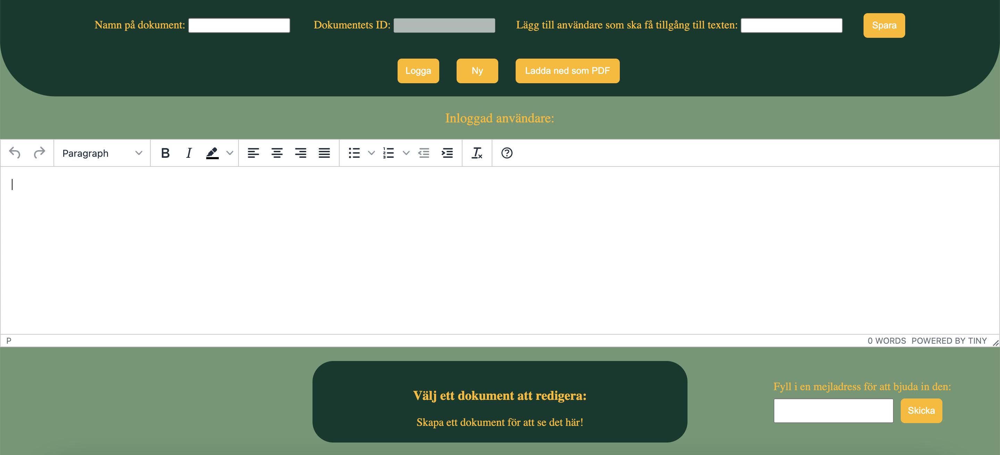

# Frontend

[](https://app.travis-ci.com/sigridjonsson/frontendJS)

An app made with the framework React and the text editor TinyMCE.
The app is made as part of the course [jsramverk](https://jsramverk.se) at BTH.

Get going
-----------------------------------
Install the essentials to get going with the application.
```
npm install
```
```
npm start
```

Screenshot
-----------------------------------

